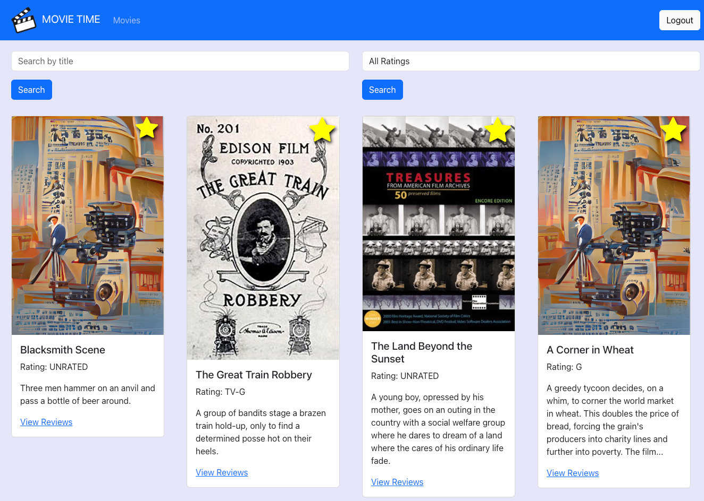
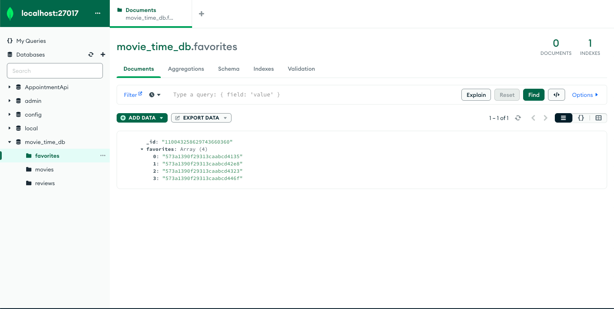
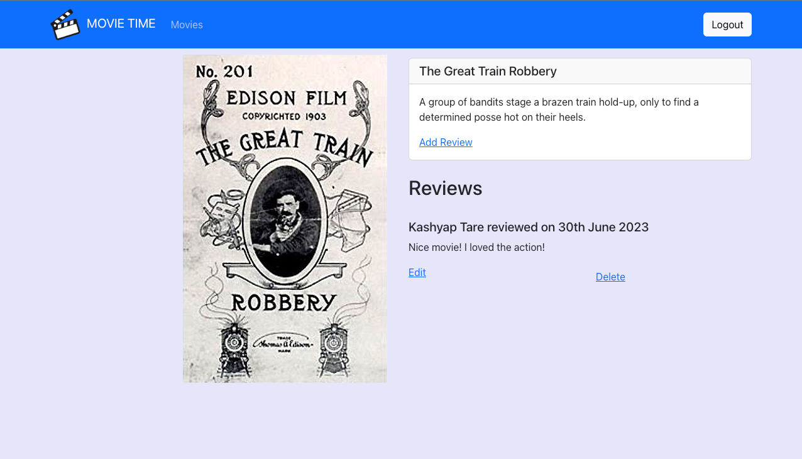
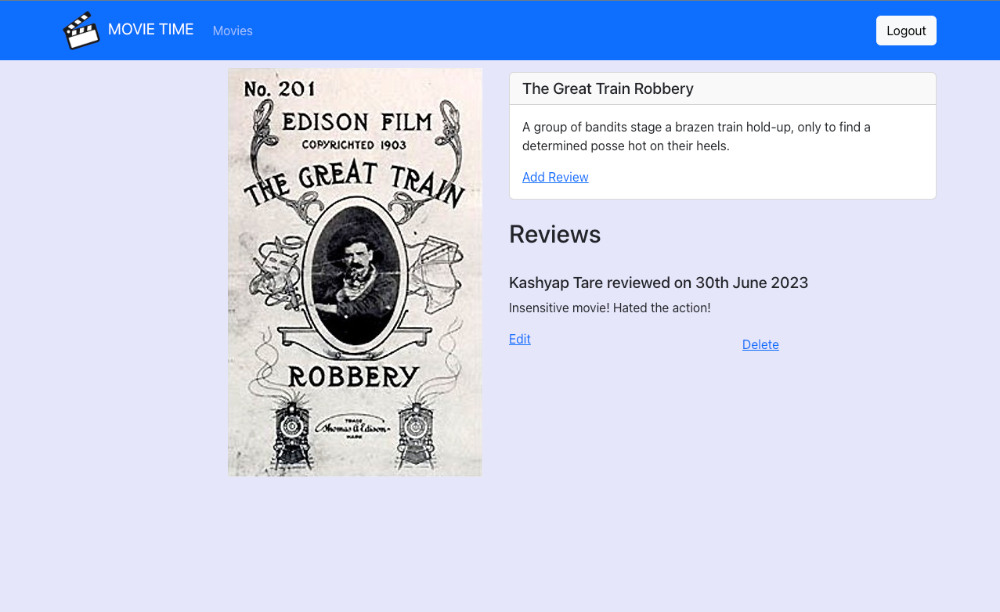
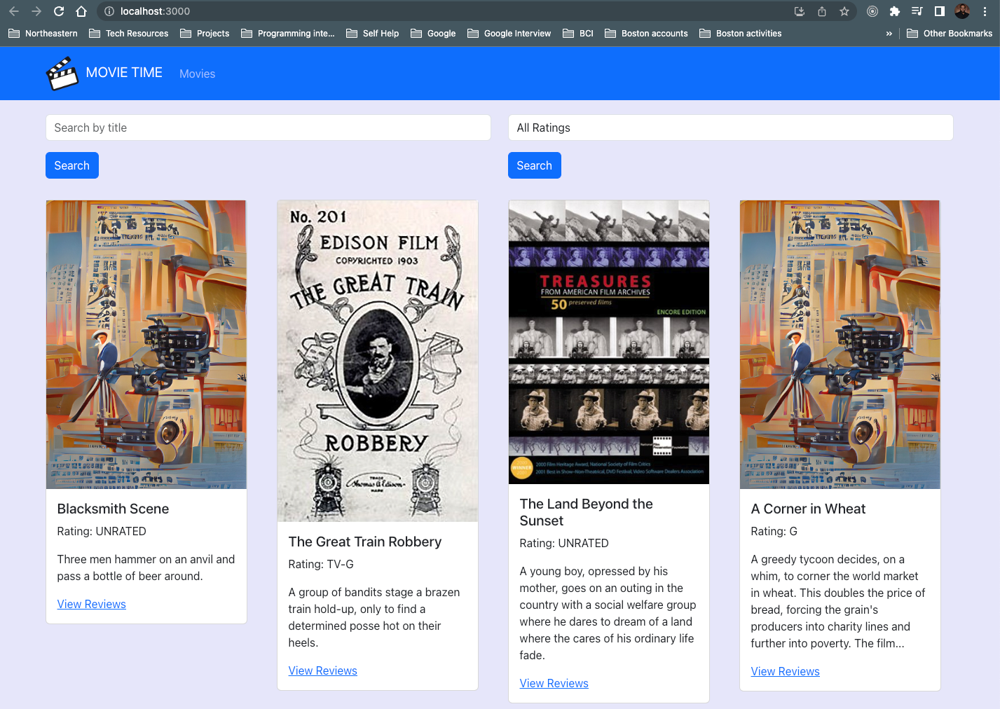
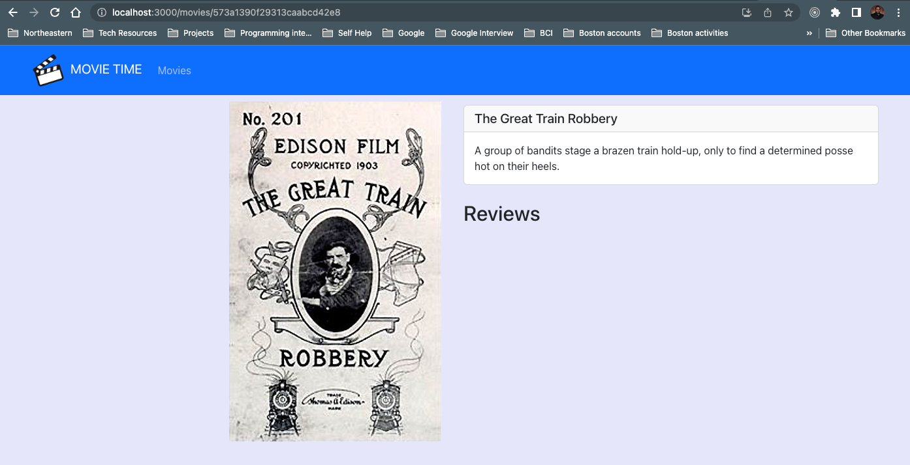
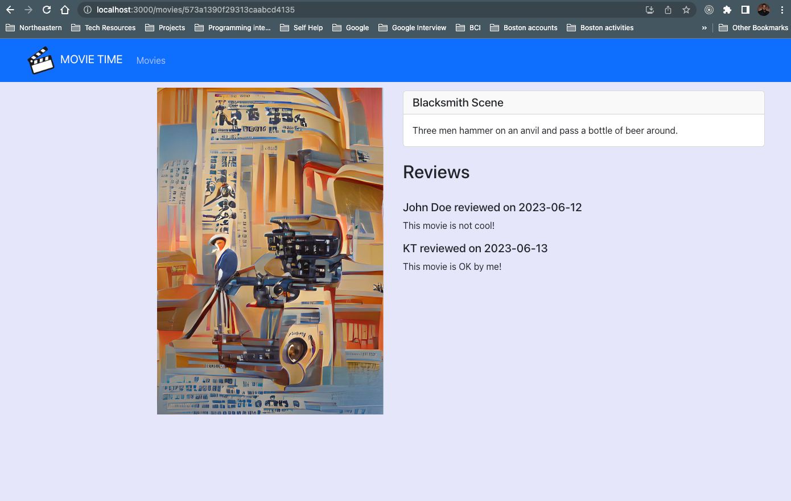
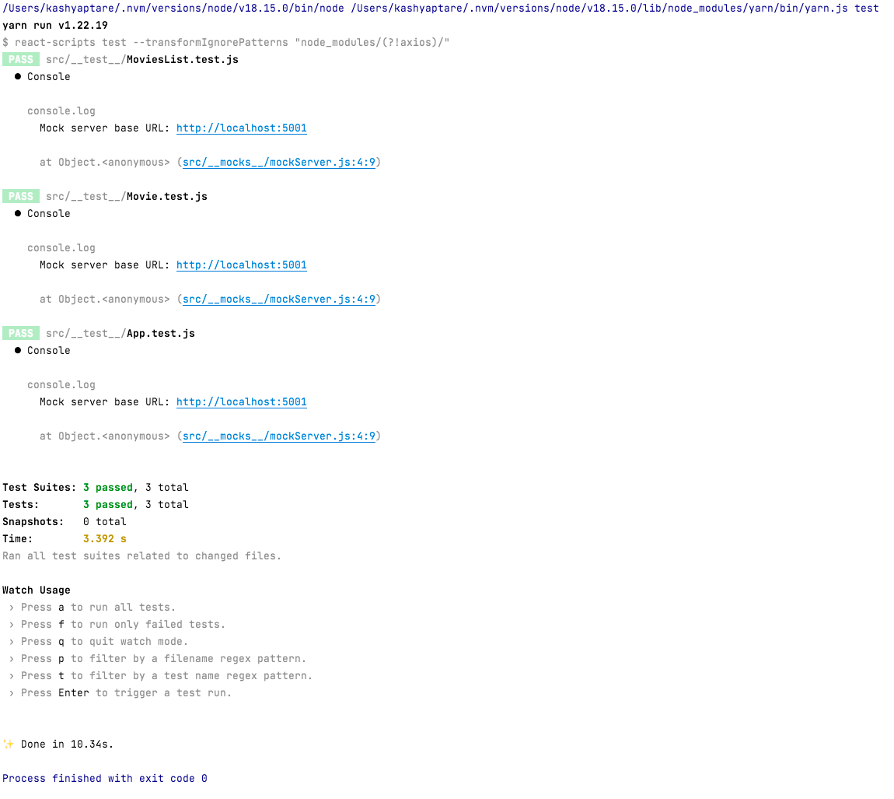

# Mern Project Part 5

---

### Tasks achieved:

> Added the ability to select favorites  

### A screenshot of the top page with the favorites stars displayed

### A screenshot of the favorites list database table displayed in MongoDB Compass

---

# Mern Project Part 4

---

### Tasks achieved:

> Added login/logout functionality.  
> Added the ability to create/update/delete reviews

### A screenshot of a movie reviews page with a newly written review

### A screenshot of the same page with the review edited

---

# MERN Project Part 3

---

### Tasks achieved:

> Added a frontend that displays a list of movies as a landing page, and allows the user to select a movie from the list
> to view in more detail.   
> Added a service that makes http requests to the backend.   
> Added a set of tests for the frontend

### A screenshot of your browser displaying the app at localhost:3000 with at least one movie showing the placeholder poster

### A screenshot of your browser showing a single movie page where the movie has its own poster

### A screenshot of your browser showing a single move page with the placeholder post

### A screenshot of the command line showing (at least) three passed tests (including the 2 we've already written, plus one for the Movie component) when you run yarn test

---